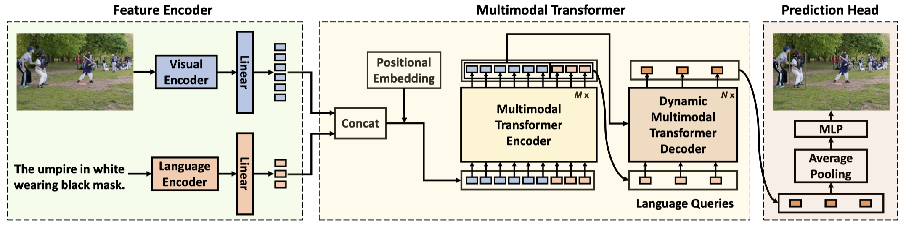

###  Dynamic MDETR: A Dynamic Multimodal Transformer Decoder for Visual Grounding (T-PAMI 2024)

[Fengyuan Shi](https://shifengyuan1999.github.io/), 
[Ruopeng Gao](https://ruopenggao.com/),
[Weilin Huang](https://www.whuang.org/),
[Limin Wang](https://wanglimin.github.io/)
<br/>

[](https://arxiv.org/abs/2209.13959)

<p align="center">

</p>


## Requirements

```shell
conda create -n dynamic-mdetr python=3.10
conda activate dynamic-mdetr
bash install.txt
```

## Getting Started
Please refer to [GETTING_STARGTED.md](docs/GETTING_STARTED.md) to learn how to prepare the datasets and pretrained checkpoints.

## Training
```shell
export CUDA_VISIBLE_DEVICES=0,1,2,3,4,5,6,7
# refcocog-g
python -m torch.distributed.launch --nproc_per_node=8 --use_env train.py --model_type ResNet --batch_size 16 --lr_bert 0.00001 --aug_crop --aug_scale --aug_translate --backbone resnet50 --detr_model ./checkpoints/detr-r50-gref.pth --bert_enc_num 12 --detr_enc_num 6 --dataset gref --max_query_len 40 --output_dir outputs/refcocog_gsplit_r50 --stages 3 --vl_fusion_enc_layers 3 --uniform_learnable True --in_points 36 --lr 1e-4 --different_transformer True --lr_drop 60 --vl_dec_layers 1 --vl_enc_layers 1 --clip_max_norm 1.0
# refcocog-u
python -m torch.distributed.launch --nproc_per_node=8 --use_env train.py --model_type ResNet --batch_size 16 --lr_bert 0.00001 --aug_crop --aug_scale --aug_translate --backbone resnet50 --detr_model ./checkpoints/detr-r50-gref.pth --bert_enc_num 12 --detr_enc_num 6 --dataset gref_umd --max_query_len 40 --output_dir outputs/refcocog_usplit_r50 --stages 3 --vl_fusion_enc_layers 3 --uniform_learnable True --in_points 36 --lr 1e-4 --different_transformer True --lr_drop 60 --vl_dec_layers 1 --vl_enc_layers 1 --clip_max_norm 1.0
# refcoco
python -m torch.distributed.launch --nproc_per_node=8 --use_env train.py --model_type ResNet --batch_size 16 --lr_bert 0.00001 --aug_crop --aug_scale --aug_translate --backbone resnet50 --detr_model ./checkpoints/detr-r50-unc.pth --bert_enc_num 12 --detr_enc_num 6 --dataset unc --max_query_len 20 --output_dir outputs/refcoco_r50 --stages 3 --vl_fusion_enc_layers 3 --uniform_learnable True --in_points 36 --lr 1e-4 --different_transformer True --lr_drop 60 --vl_dec_layers 1 --vl_enc_layers 1 --clip_max_norm 1.0
# refcoco plus
python -m torch.distributed.launch --nproc_per_node=8 --use_env train.py --model_type ResNet --batch_size 16 --lr_bert 0.00001 --aug_crop --aug_scale --aug_translate --backbone resnet50 --detr_model ./checkpoints/detr-r50-unc.pth --bert_enc_num 12 --detr_enc_num 6 --dataset unc+ --max_query_len 20 --output_dir outputs/refcoco_plus_r50 --stages 3 --vl_fusion_enc_layers 3 --uniform_learnable True --in_points 36 --lr 1e-4 --different_transformer True --lr_drop 60 --vl_dec_layers 1 --vl_enc_layers 1 --clip_max_norm 1.0
# referit
python -m torch.distributed.launch --nproc_per_node=8 --use_env train.py --model_type ResNet --batch_size 16 --lr_bert 0.00001 --aug_crop --aug_scale --aug_translate --backbone resnet50 --detr_model ./checkpoints/detr-r50-referit.pth --bert_enc_num 12 --detr_enc_num 6 --dataset referit --max_query_len 20 --output_dir outputs/referit_r50 --stages 3 --vl_fusion_enc_layers 3 --uniform_learnable True --in_points 36 --lr 1e-4 --different_transformer True --lr_drop 60 --vl_dec_layers 1 --vl_enc_layers 1 --clip_max_norm 1.0 --weight_decay 0.0 --vl_dropout 0.0 --dropout 0.0
# flickr
python -m torch.distributed.launch --nproc_per_node=8 --use_env train.py --model_type ResNet --batch_size 16 --lr_bert 0.00001 --aug_crop --aug_scale --aug_translate --backbone resnet50 --detr_model ./checkpoints/detr-r50-referit.pth --bert_enc_num 12 --detr_enc_num 6 --dataset flickr --max_query_len 20 --output_dir outputs/flickr_r50 --stages 3 --vl_fusion_enc_layers 3 --uniform_learnable True --in_points 36 --lr 1e-4 --different_transformer True --epochs 60 --lr_drop 40  --vl_dec_layers 1 --vl_enc_layers 1 --clip_max_norm 1.0
```

## Inference
[Checkpoints](https://drive.google.com/drive/folders/1stGPq4Sz_Vu60QliUzey8m6iYXrrF3Ua?usp=drive_link)
```shell
export CUDA_VISIBLE_DEVICES=0,1,2,3,4,5,6,7
# refcocog-g
python -m torch.distributed.launch --nproc_per_node=8 --use_env eval.py --model_type ResNet --batch_size 16 --backbone resnet50 --bert_enc_num 12 --detr_enc_num 6 --dataset gref --max_query_len 40 --output_dir outputs/refcocog_gsplit_r50 --stages 3 --vl_fusion_enc_layers 3 --uniform_learnable True --in_points 36 --lr 1e-4 --different_transformer True --lr_drop 60 --vl_dec_layers 1 --vl_enc_layers 1 --eval_model outputs/refcocog_gsplit_r50/best_checkpoint.pth --eval_set val
```

## Citation
If you make use of our work, please cite our paper.
```bibtex
@article{shi2024dynamic,
  title={Dynamic MDETR: A Dynamic Multimodal Transformer Decoder for Visual Grounding},
  author={Shi, Fengyuan and Gao, Ruopeng and Huang, Weilin and Wang, Limin},
  journal={IEEE Transactions on Pattern Analysis and Machine Intelligence},
  volume={46},
  number={2},
  pages={1181--1198},
  year={2024},
  publisher={IEEE}
}
```

## Acknowledgments
This project is built upon [TransVG](https://github.com/djiajunustc/TransVG). Thanks for their wonderful work!